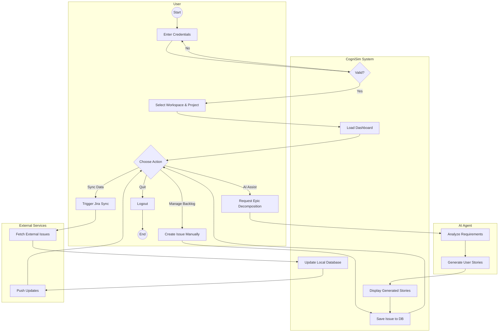

# System Activity Diagram - CogniSim AI

This document illustrates the end-to-end workflow of the CogniSim AI system, showing how different actors interact to achieve key objectives.

## Activity Flow

The diagram uses swimlanes to distinguish between the **User**, the **System** (Frontend/Backend), the **AI Agent**, and **External Services**.

### Diagram

## Workflow Description

1.  **Authentication:** The user starts by logging in. The system validates credentials.
2.  **Initialization:** Upon success, the user selects a workspace and project, loading the dashboard.
3.  **Main Loop:** The user can perform three primary types of actions:
    *   **Manual Management:** Creating and editing issues directly.
    *   **AI Assistance:** Requesting the AI Agent to decompose epics or estimate points. The AI processes this and returns structured data to the system.
    *   **Integrations:** Triggering synchronization with external tools like Jira. The system fetches and pushes data to keep both sides in sync.
4.  **Termination:** The user logs out to end the session.
