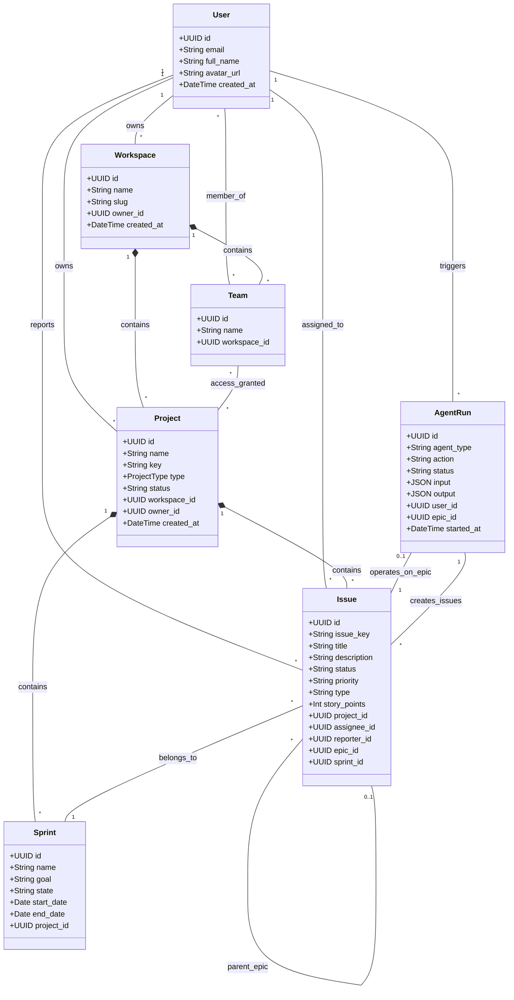

# System Class Diagram - CogniSim AI

This document details the object-oriented structure of the system's data models, derived from the Pydantic schemas and database tables.

## Class Structure

The diagram highlights the core entities: **Users**, **Workspaces**, **Projects**, **Issues**, and **AI Agents**.

### Diagram

## Class Descriptions

### 1. Core Entities
*   **User:** Represents a registered system user.
*   **Workspace:** The top-level container for all resources (projects, teams). A user can belong to multiple workspaces.
*   **Project:** A specific initiative (Scrum or Kanban) containing issues and sprints.

### 2. Work Items
*   **Issue:** The fundamental unit of work (Task, Bug, Story, Epic). It has a lifecycle (status) and estimation (story points).
*   **Sprint:** A time-boxed iteration in a Scrum project containing a subset of issues.

### 3. Organization
*   **Team:** A group of users within a workspace. Teams can be granted access to specific projects.

### 4. AI & Automation
*   **AgentRun:** A record of an AI agent's execution. It links the user's request (input) to the generated results (output) and any artifacts created (e.g., new issues).
