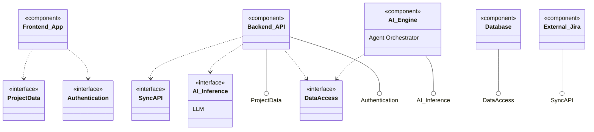

# System Component Diagram - CogniSim AI

This document illustrates the high-level architectural components of the CogniSim AI system and their interdependencies.

## Component Architecture

The system follows a modern microservices-inspired architecture, separating concerns between the client interface, business logic API, data persistence, and specialized AI services.

### Diagram

## Component Descriptions

### 1. Components
*   **Frontend_App:** The client-side application handling user interaction.
*   **Backend_API:** The central server managing business logic and security.
*   **Database:** The persistent storage for structured data and vector embeddings.
*   **AI_Engine:** The subsystem responsible for decomposing epics and generating content.
*   **External_Jira:** The third-party system integrated for issue synchronization.

### 2. Interfaces (Connectors)
*   **I_Auth:** The contract for user identification and session management.
*   **I_ProjectAPI:** The set of endpoints for creating and managing projects/issues.
*   **I_DataQuery:** The protocol for reading/writing to the database.
*   **I_Inference:** The interface for sending prompts to the LLM and receiving responses.
*   **I_Integration:** The API contract for syncing data with external tools.

