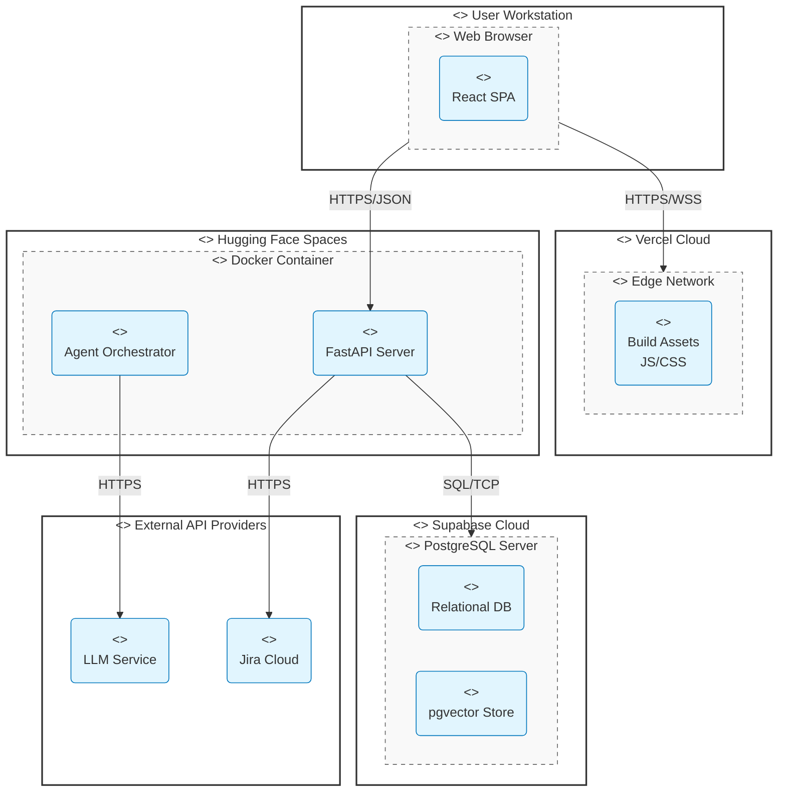

# System Deployment Diagram - CogniSim AI

This document illustrates the physical deployment of the CogniSim AI system, mapping software artifacts to their execution environments and hardware nodes.

## Deployment Architecture

The system utilizes a cloud-native deployment strategy, leveraging serverless frontend hosting (Vercel), containerized backend services (Hugging Face), and managed database services (Supabase).

### Diagram

## Node Descriptions

### 1. User Workstation
*   **Device:** The end-user's computer or mobile device.
*   **Execution Environment:** Modern Web Browser (Chrome, Firefox, Edge).
*   **Artifact:** **React SPA**, the client-side application code running locally.

### 2. Vercel Cloud (Frontend Host)
*   **Device:** Vercel's global content delivery network.
*   **Execution Environment:** Edge Network.
*   **Artifact:** **Build Assets**, the static JavaScript, CSS, and HTML files served to the client.

### 3. Hugging Face Spaces (Backend Host)
*   **Device:** Cloud infrastructure provided by Hugging Face.
*   **Execution Environment:** Docker Container (Python 3.10 Runtime).
*   **Artifacts:**
    *   **FastAPI Server:** The main API gateway handling requests.
    *   **Agent Orchestrator:** The Python logic controlling AI workflows.

### 4. Supabase Cloud (Database Host)
*   **Device:** Managed database infrastructure.
*   **Execution Environment:** PostgreSQL Server.
*   **Artifacts:**
    *   **Relational DB:** Stores users, projects, and issues.
    *   **pgvector Store:** Stores high-dimensional vector embeddings for AI.

### 5. External API Providers
*   **LLM Service:** External AI model providers (e.g., OpenAI, Anthropic) accessed via API.
*   **Jira Cloud:** The external issue tracking system integrated via REST API.
