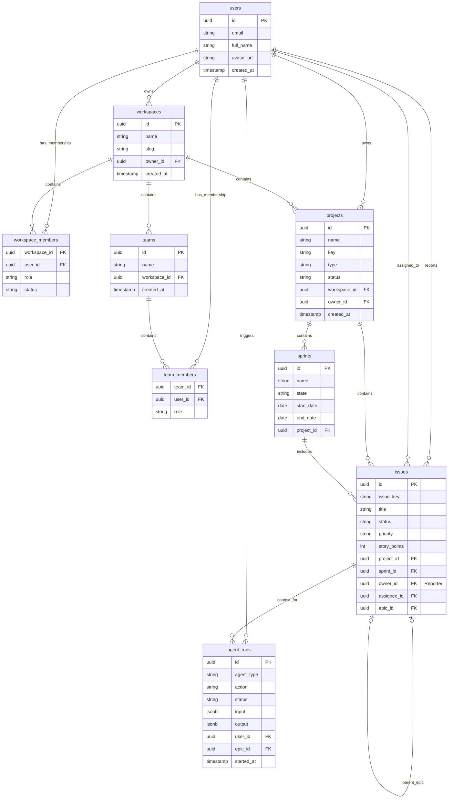

# System Entity Relationship Diagram (ERD) - CogniSim AI

This document visualizes the database schema and relationships between the core entities in the CogniSim AI system.

## Database Schema

The system uses a relational database (PostgreSQL) with the following structure.

### Diagram

## Entity Descriptions

### 1. Identity & Access
*   **users:** The central identity table (managed by Supabase Auth).
*   **workspaces:** The highest level of organization. Users can be members of multiple workspaces.
*   **teams:** Sub-groups within a workspace for granular access control.

### 2. Project Management
*   **projects:** Containers for work, following either Scrum or Kanban methodologies.
*   **sprints:** Time-boxed iterations for Scrum projects.
*   **issues:** The core work items. Self-referential relationship allows for Epic -> Story hierarchy.

### 3. AI Operations
*   **agent_runs:** Logs every execution of an AI agent, linking the user's prompt to the resulting artifacts (issues) and performance metrics.
