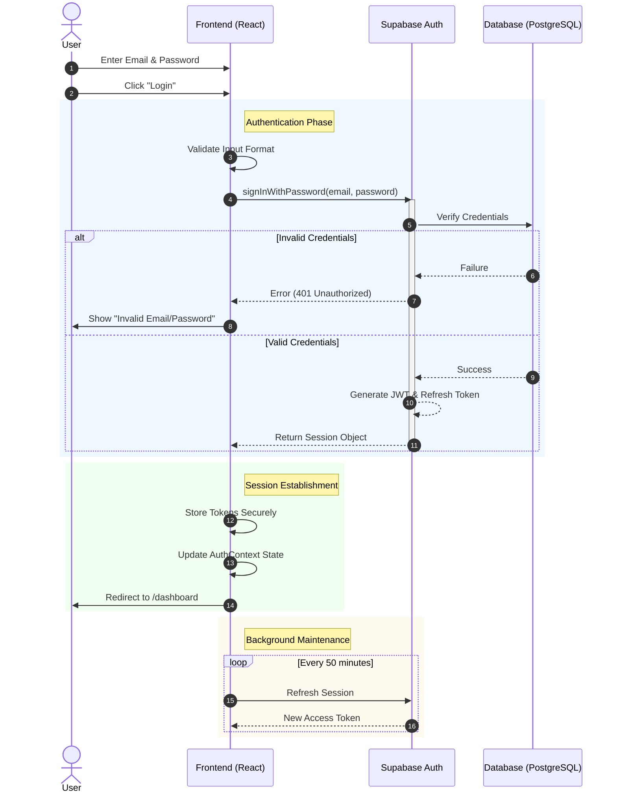
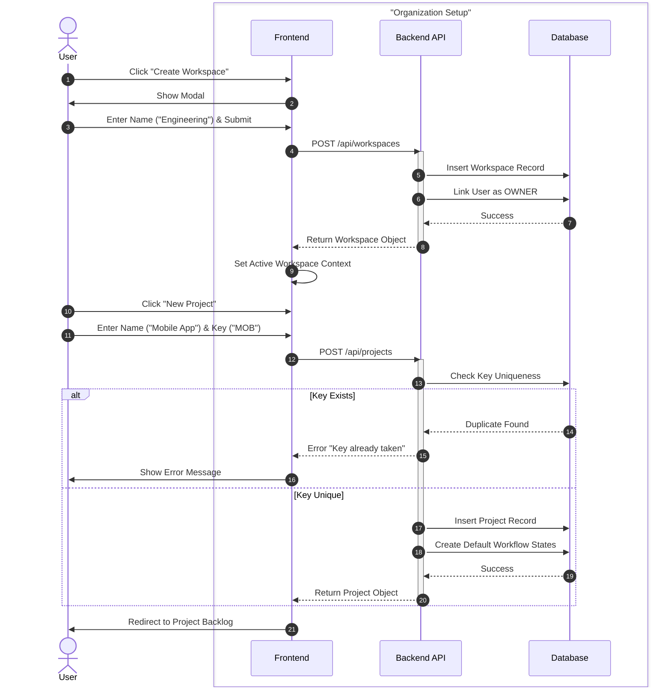
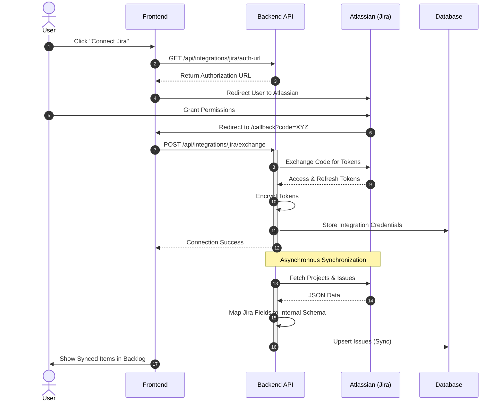
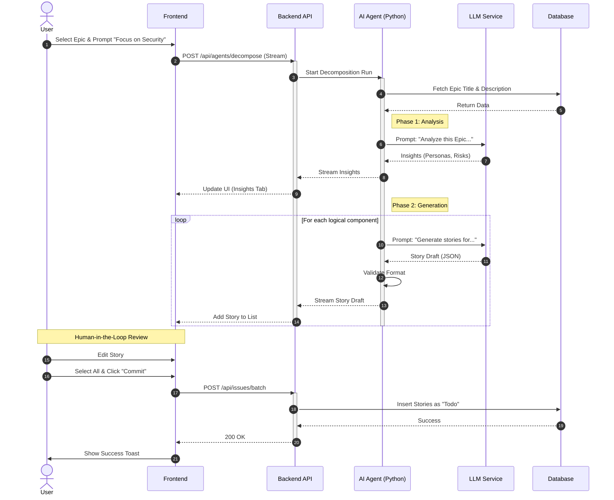

# System Sequence Diagrams - CogniSim AI

This document provides detailed sequence flows for the core modules of the CogniSim AI system. Each section includes a visual diagram and a step-by-step textual description of the interaction.

## 1. Authentication System

This flow details the complete lifecycle of user authentication, including login, session establishment, and token management.

### Sequence Flow Description
1.  **User Action:** The user enters their email and password on the login page.
2.  **Frontend Validation:** The React frontend validates the input format (e.g., valid email).
3.  **Authentication Request:** The frontend sends a `signInWithPassword` request to the Supabase Auth service.
4.  **Verification:** Supabase Auth verifies the credentials against the secure user registry.
    *   *Alt Path:* If invalid, an error is returned, and the user is notified.
5.  **Session Creation:** Upon success, Supabase generates an Access Token (JWT) and a Refresh Token.
6.  **Token Storage:** The frontend stores these tokens securely (e.g., in local storage or cookies).
7.  **State Update:** The global Auth Context is updated with the user's profile.
8.  **Navigation:** The user is redirected to the Dashboard.
9.  **Session Refresh (Background):** As the user interacts, the client automatically refreshes the token before it expires.

### Diagram

---

## 2. Workspace & Project Management

This flow illustrates how a user creates a new organizational environment (Workspace) and initializes a Project within it.

### Sequence Flow Description
1.  **Create Workspace:** The user requests to create a new Workspace (e.g., "Engineering").
2.  **Backend Processing:** The API creates the workspace and automatically assigns the creator as the "Workspace Owner".
3.  **Context Switch:** The frontend updates the active workspace context.
4.  **Create Project:** Inside the workspace, the user creates a new Project (e.g., "Mobile App").
5.  **Validation:** The system checks if the Project Key (e.g., "MOB") is unique within the workspace.
6.  **Initialization:** The system creates the project and initializes default settings (e.g., default workflow states like Todo, In Progress).
7.  **Navigation:** The user is taken to the new project's backlog.

### Diagram

---

## 3. Integrations (Jira)

This flow demonstrates the OAuth 2.0 handshake to connect a Jira account and the subsequent data synchronization.

### Sequence Flow Description
1.  **Initiate Connection:** User clicks "Connect Jira".
2.  **OAuth Redirect:** The system redirects the user to Atlassian's authorization server.
3.  **User Authorization:** User logs in to Jira and grants permission to CogniSim AI.
4.  **Callback:** Atlassian redirects back to CogniSim with an authorization code.
5.  **Token Exchange:** The backend exchanges the code for an Access Token and Refresh Token.
6.  **Credential Storage:** Tokens are encrypted and stored in the database.
7.  **Data Sync:** The system fetches projects and issues from Jira and maps them to CogniSim's internal structure.

### Diagram

---

## 4. AI Modules (Epic Decomposition)

This flow details the complex interaction of the "Epic Architect" agent, which breaks down large requirements into executable user stories.

### Sequence Flow Description
1.  **Trigger:** User selects an Epic and provides optional guidance (e.g., "Focus on security").
2.  **Agent Initialization:** The backend initializes the AI Agent with the Epic's context.
3.  **Analysis Phase:** The Agent uses an LLM to analyze the requirements, identifying user personas and acceptance criteria.
4.  **Generation Phase:** The Agent iteratively generates User Stories.
5.  **Streaming:** Results are streamed to the frontend in real-time (Server-Sent Events) so the user sees progress.
6.  **Human Review:** The user reviews the drafts, edits if necessary, and selects stories to keep.
7.  **Commit:** The selected stories are saved to the database as official backlog items.

### Diagram

