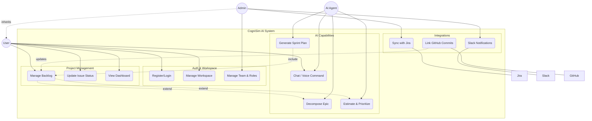

# System Use Cases - CogniSim AI

## 1. Actors

| Actor | Description |
| :--- | :--- |
| **User** | A registered user of the platform. Can perform basic project and task management actions. |
| **Team Admin** | A user with administrative privileges within a specific Team. Can manage members and settings. |
| **Workspace Admin** | A user with administrative privileges for an entire Workspace. Can manage integrations and billing. |
| **AI Agent** | The internal AI system that performs automated tasks (decomposition, estimation, reporting). |
| **External System** | Third-party platforms (Jira, Slack, GitHub) that interact with CogniSim AI. |

## 2. Use Case List

### 2.1 Authentication & Account
*   **UC-01:** Register New Account (FR-01)
*   **UC-02:** Login (FR-02)
*   **UC-03:** Logout (FR-04)
*   **UC-04:** Invite User to Team/Workspace (FR-05)
*   **UC-05:** Delete Account (FR-06)

### 2.2 Project Management
*   **UC-06:** Create & Switch Workspaces (FR-07)
*   **UC-07:** Create Project (FR-08)
*   **UC-08:** Manage Backlog (Create/Edit/Delete Issues) (FR-09, FR-11)
*   **UC-09:** Update Issue Status (Kanban Drag-and-Drop) (FR-10)

### 2.3 AI Assistance
*   **UC-10:** Decompose Epic into Stories (FR-12)
*   **UC-11:** Estimate Story Points (FR-13)
*   **UC-12:** Prioritize Backlog (FR-14)
*   **UC-13:** Generate Sprint Plan (FR-15)
*   **UC-14:** Generate Project Report (FR-16)

### 2.4 Collaboration & Team
*   **UC-15:** Manage Team Profile (FR-20)
*   **UC-16:** Manage Member Roles (FR-21)

### 2.5 Integrations
*   **UC-17:** Connect Jira Account (FR-22)
*   **UC-18:** Sync Data with Jira (FR-23)
*   **UC-19:** Connect Slack Workspace (FR-24)
*   **UC-20:** Configure Slack Notifications (FR-25)
*   **UC-21:** Link GitHub Commits (FR-26)

### 2.6 Interfaces
*   **UC-22:** View Real-time Dashboard (FR-17)
*   **UC-23:** Chat with AI Assistant (FR-18)
*   **UC-24:** Execute Voice Command (FR-19)

## 3. Use Case Diagram (Mermaid)

## 4. Detailed Use Case Specifications

### 4.1 Authentication & Account

#### UC-01: Register New Account
| Field | Details |
| :--- | :--- |
| **Use Case ID** | UC-01 |
| **Use Case Name** | Register New Account |
| **Actor(s)** | User |
| **Pre-Conditions** | User does not have an active session. |
| **Priority** | High |
| **Basic Flow** | User creates a new account by providing email and password. |
| **Cross Reference** | FR-01 |

| Actor's Actions | System's Response |
| :--- | :--- |
| 1. User navigates to the Signup page. | 2. System displays the registration form. |
| 3. User enters valid email and password and clicks "Sign Up". | 4. System validates credentials format. |
| | 5. System creates new user record in auth provider. |
| | 6. System redirects user to the Dashboard. |

**Alternative Flow:**
*   **3a. User enters an email that is already registered:**
    *   1. System displays an error message: "User already exists".

#### UC-02: Login
| Field | Details |
| :--- | :--- |
| **Use Case ID** | UC-02 |
| **Use Case Name** | Login |
| **Actor(s)** | User |
| **Pre-Conditions** | User is registered in the system. |
| **Priority** | High |
| **Basic Flow** | User logs in with existing credentials. |
| **Cross Reference** | FR-02, FR-03 |

| Actor's Actions | System's Response |
| :--- | :--- |
| 1. User navigates to Login page. | 2. System displays login form. |
| 3. User enters email and password and clicks "Login". | 4. System validates credentials against database. |
| | 5. System generates session token and redirects to Dashboard. |

**Alternative Flow:**
*   **3a. User enters invalid credentials:**
    *   1. System displays error: "Invalid email or password".

#### UC-03: Logout
| Field | Details |
| :--- | :--- |
| **Use Case ID** | UC-03 |
| **Use Case Name** | Logout |
| **Actor(s)** | User |
| **Pre-Conditions** | User is logged in. |
| **Priority** | Medium |
| **Basic Flow** | User terminates their current session. |
| **Cross Reference** | FR-04 |

| Actor's Actions | System's Response |
| :--- | :--- |
| 1. User clicks "Logout" button in profile menu. | 2. System invalidates the current session token. |
| | 3. System redirects user to the Login page. |

#### UC-04: Invite User
| Field | Details |
| :--- | :--- |
| **Use Case ID** | UC-04 |
| **Use Case Name** | Invite User |
| **Actor(s)** | Team/Workspace Admin |
| **Pre-Conditions** | User is logged in and has admin privileges. |
| **Priority** | Medium |
| **Basic Flow** | Admin invites a new member via email. |
| **Cross Reference** | FR-05 |

| Actor's Actions | System's Response |
| :--- | :--- |
| 1. Admin navigates to Team Settings > Members. | 2. System displays current members list. |
| 3. Admin clicks "Invite Member" and enters email. | 4. System generates unique invitation token. |
| | 5. System sends invitation email to the provided address. |
| | 6. System displays success message. |

#### UC-05: Delete Account
| Field | Details |
| :--- | :--- |
| **Use Case ID** | UC-05 |
| **Use Case Name** | Delete Account |
| **Actor(s)** | User |
| **Pre-Conditions** | User is logged in. |
| **Priority** | Low |
| **Basic Flow** | User permanently deletes their account. |
| **Cross Reference** | FR-06 |

| Actor's Actions | System's Response |
| :--- | :--- |
| 1. User navigates to Account Settings. | 2. System displays account options. |
| 3. User clicks "Delete Account" and confirms. | 4. System deletes user data from database. |
| | 5. System removes user from auth provider. |
| | 6. System redirects to Signup page. |

### 4.2 Project Management

#### UC-06: Create & Switch Workspaces
| Field | Details |
| :--- | :--- |
| **Use Case ID** | UC-06 |
| **Use Case Name** | Create & Switch Workspaces |
| **Actor(s)** | User |
| **Pre-Conditions** | User is logged in. |
| **Priority** | High |
| **Basic Flow** | User creates a new workspace or switches to an existing one. |
| **Cross Reference** | FR-07 |

| Actor's Actions | System's Response |
| :--- | :--- |
| 1. User opens Workspace selector. | 2. System displays list of available workspaces. |
| 3. User clicks "Create Workspace" and enters name. | 4. System creates new workspace and sets user as Admin. |
| | 5. System switches context to the new workspace. |

**Alternative Flow:**
*   **3a. User selects an existing workspace:**
    *   1. System switches context to the selected workspace.

#### UC-07: Create Project
| Field | Details |
| :--- | :--- |
| **Use Case ID** | UC-07 |
| **Use Case Name** | Create Project |
| **Actor(s)** | User |
| **Pre-Conditions** | User is in an active Workspace. |
| **Priority** | High |
| **Basic Flow** | User creates a new project within the workspace. |
| **Cross Reference** | FR-08 |

| Actor's Actions | System's Response |
| :--- | :--- |
| 1. User navigates to Projects list. | 2. System displays existing projects. |
| 3. User clicks "New Project". | 4. System displays project creation modal. |
| 5. User enters Name, Key, and Description. | 6. System validates uniqueness of Project Key. |
| | 7. System creates project and redirects to Backlog. |

#### UC-08: Manage Backlog
| Field | Details |
| :--- | :--- |
| **Use Case ID** | UC-08 |
| **Use Case Name** | Manage Backlog |
| **Actor(s)** | User |
| **Pre-Conditions** | User is in a Project. |
| **Priority** | High |
| **Basic Flow** | User creates and manages issues in the backlog. |
| **Cross Reference** | FR-09, FR-11 |

| Actor's Actions | System's Response |
| :--- | :--- |
| 1. User navigates to Backlog view. | 2. System displays list of issues. |
| 3. User clicks "Create Issue". | 4. System displays inline creation form. |
| 5. User enters Summary and Type (Story/Bug/Task). | 6. System adds issue to the backlog bottom. |
| 7. User clicks an issue to edit details. | 8. System opens issue detail view (Description, Points, etc.). |

#### UC-09: Update Issue Status
| Field | Details |
| :--- | :--- |
| **Use Case ID** | UC-09 |
| **Use Case Name** | Update Issue Status |
| **Actor(s)** | User |
| **Pre-Conditions** | Active Sprint with issues. |
| **Priority** | High |
| **Basic Flow** | User moves an issue on the Kanban board. |
| **Cross Reference** | FR-10 |

| Actor's Actions | System's Response |
| :--- | :--- |
| 1. User navigates to Board view. | 2. System displays Kanban columns (Todo, In Progress, Done). |
| 3. User drags an issue from "Todo" to "In Progress". | 4. System updates issue status in database. |
| | 5. System reflects change in UI for all users. |

### 4.3 AI Assistance

#### UC-10: Decompose Epic into Stories
| Field | Details |
| :--- | :--- |
| **Use Case ID** | UC-10 |
| **Use Case Name** | Decompose Epic into Stories |
| **Actor(s)** | User, AI Agent |
| **Pre-Conditions** | User has selected an Epic. |
| **Priority** | High |
| **Basic Flow** | AI breaks down an epic into detailed user stories. |
| **Cross Reference** | FR-12 |

| Actor's Actions | System's Response |
| :--- | :--- |
| 1. User clicks "Decompose with AI" on an Epic. | 2. System sends epic details to AI Agent. |
| | 3. AI Agent analyzes requirements and generates stories. |
| | 4. System displays generated stories for review. |
| 5. User reviews and clicks "Commit Stories". | 6. System saves stories to the backlog. |

#### UC-11: Estimate Story Points
| Field | Details |
| :--- | :--- |
| **Use Case ID** | UC-11 |
| **Use Case Name** | Estimate Story Points |
| **Actor(s)** | User, AI Agent |
| **Pre-Conditions** | User stories exist in backlog. |
| **Priority** | Medium |
| **Basic Flow** | AI estimates effort for user stories. |
| **Cross Reference** | FR-13 |

| Actor's Actions | System's Response |
| :--- | :--- |
| 1. User selects stories and clicks "AI Estimate". | 2. AI Agent analyzes story complexity and history. |
| | 3. System updates stories with estimated points. |
| | 4. System displays confidence score and reasoning. |

#### UC-12: Prioritize Backlog
| Field | Details |
| :--- | :--- |
| **Use Case ID** | UC-12 |
| **Use Case Name** | Prioritize Backlog |
| **Actor(s)** | User, AI Agent |
| **Pre-Conditions** | Backlog contains multiple issues. |
| **Priority** | Medium |
| **Basic Flow** | AI ranks backlog items by value and risk. |
| **Cross Reference** | FR-14 |

| Actor's Actions | System's Response |
| :--- | :--- |
| 1. User clicks "AI Prioritize". | 2. AI Agent evaluates Value, Effort, and Risk. |
| | 3. System reorders backlog based on scores. |
| | 4. System displays explanation for ranking. |

#### UC-13: Generate Sprint Plan
| Field | Details |
| :--- | :--- |
| **Use Case ID** | UC-13 |
| **Use Case Name** | Generate Sprint Plan |
| **Actor(s)** | User, AI Agent |
| **Pre-Conditions** | Backlog is prioritized, Team capacity set. |
| **Priority** | Medium |
| **Basic Flow** | AI suggests stories for the next sprint. |
| **Cross Reference** | FR-15 |

| Actor's Actions | System's Response |
| :--- | :--- |
| 1. User clicks "Plan Sprint". | 2. AI Agent analyzes capacity and dependencies. |
| | 3. System suggests a list of stories for the sprint. |
| 4. User reviews and clicks "Start Sprint". | 5. System moves stories to Active Sprint board. |

#### UC-14: Generate Project Report
| Field | Details |
| :--- | :--- |
| **Use Case ID** | UC-14 |
| **Use Case Name** | Generate Project Report |
| **Actor(s)** | User, AI Agent |
| **Pre-Conditions** | Project data is available. |
| **Priority** | Low |
| **Basic Flow** | AI generates a status report. |
| **Cross Reference** | FR-16 |

| Actor's Actions | System's Response |
| :--- | :--- |
| 1. User clicks "Generate Report". | 2. AI Agent aggregates metrics and progress. |
| | 3. System generates summary text and charts. |
| | 4. System displays report for download/sharing. |

### 4.4 Collaboration & Team

#### UC-15: Manage Team Profile
| Field | Details |
| :--- | :--- |
| **Use Case ID** | UC-15 |
| **Use Case Name** | Manage Team Profile |
| **Actor(s)** | Team Admin |
| **Pre-Conditions** | User is Team Admin. |
| **Priority** | Low |
| **Basic Flow** | Admin updates team name or description. |
| **Cross Reference** | FR-20 |

| Actor's Actions | System's Response |
| :--- | :--- |
| 1. Admin navigates to Team Settings. | 2. System displays team details form. |
| 3. Admin updates Name/Description and clicks "Save". | 4. System updates team record. |
| | 5. System displays success notification. |

#### UC-16: Manage Member Roles
| Field | Details |
| :--- | :--- |
| **Use Case ID** | UC-16 |
| **Use Case Name** | Manage Member Roles |
| **Actor(s)** | Team Admin |
| **Pre-Conditions** | User is Team Admin. |
| **Priority** | Medium |
| **Basic Flow** | Admin changes role of a team member. |
| **Cross Reference** | FR-21 |

| Actor's Actions | System's Response |
| :--- | :--- |
| 1. Admin navigates to Members list. | 2. System displays members and current roles. |
| 3. Admin selects new role for a user. | 4. System updates user's role in the team. |
| | 5. System updates permissions immediately. |

### 4.5 Integrations

#### UC-17: Connect Jira Account
| Field | Details |
| :--- | :--- |
| **Use Case ID** | UC-17 |
| **Use Case Name** | Connect Jira Account |
| **Actor(s)** | Workspace Admin |
| **Pre-Conditions** | User is Workspace Admin. |
| **Priority** | High |
| **Basic Flow** | Admin connects Jira via OAuth. |
| **Cross Reference** | FR-22 |

| Actor's Actions | System's Response |
| :--- | :--- |
| 1. Admin navigates to Integrations > Jira. | 2. System displays "Connect Jira" button. |
| 3. Admin clicks "Connect". | 4. System redirects to Atlassian OAuth page. |
| 5. Admin authorizes CogniSim AI. | 6. System receives and stores access token. |
| | 7. System displays "Connected" status. |

#### UC-18: Sync Data with Jira
| Field | Details |
| :--- | :--- |
| **Use Case ID** | UC-18 |
| **Use Case Name** | Sync Data with Jira |
| **Actor(s)** | System (Automated) / User |
| **Pre-Conditions** | Jira is connected. |
| **Priority** | High |
| **Basic Flow** | System synchronizes issues between platforms. |
| **Cross Reference** | FR-23 |

| Actor's Actions | System's Response |
| :--- | :--- |
| 1. User clicks "Sync Now" (or automated trigger). | 2. System fetches updated issues from Jira. |
| | 3. System pushes local changes to Jira. |
| | 4. System updates local database to match. |

#### UC-19: Connect Slack Workspace
| Field | Details |
| :--- | :--- |
| **Use Case ID** | UC-19 |
| **Use Case Name** | Connect Slack Workspace |
| **Actor(s)** | Workspace Admin |
| **Pre-Conditions** | User is Workspace Admin. |
| **Priority** | Medium |
| **Basic Flow** | Admin connects Slack workspace. |
| **Cross Reference** | FR-24 |

| Actor's Actions | System's Response |
| :--- | :--- |
| 1. Admin navigates to Integrations > Slack. | 2. System displays "Add to Slack" button. |
| 3. Admin clicks button. | 4. System redirects to Slack OAuth page. |
| 5. Admin authorizes app installation. | 6. System stores bot token. |
| | 7. System displays connected workspace name. |

#### UC-20: Configure Slack Notifications
| Field | Details |
| :--- | :--- |
| **Use Case ID** | UC-20 |
| **Use Case Name** | Configure Slack Notifications |
| **Actor(s)** | Team Admin |
| **Pre-Conditions** | Slack is connected. |
| **Priority** | Low |
| **Basic Flow** | Admin sets up notification rules. |
| **Cross Reference** | FR-25 |

| Actor's Actions | System's Response |
| :--- | :--- |
| 1. Admin navigates to Team Settings > Notifications. | 2. System displays event types and channel picker. |
| 3. Admin selects events (e.g., "Issue Created") and channel. | 4. System saves configuration. |
| | 5. System sends test notification to channel. |

#### UC-21: Link GitHub Commits
| Field | Details |
| :--- | :--- |
| **Use Case ID** | UC-21 |
| **Use Case Name** | Link GitHub Commits |
| **Actor(s)** | User / System |
| **Pre-Conditions** | GitHub integration active. |
| **Priority** | Low |
| **Basic Flow** | Commits are linked to stories via ID. |
| **Cross Reference** | FR-26 |

| Actor's Actions | System's Response |
| :--- | :--- |
| 1. User pushes code with issue key in message. | 2. GitHub sends webhook to System. |
| | 3. System parses webhook and finds Issue. |
| | 4. System adds commit link to Issue activity log. |

### 4.6 Interfaces

#### UC-22: View Real-time Dashboard
| Field | Details |
| :--- | :--- |
| **Use Case ID** | UC-22 |
| **Use Case Name** | View Real-time Dashboard |
| **Actor(s)** | User |
| **Pre-Conditions** | User is logged in. |
| **Priority** | High |
| **Basic Flow** | User views project metrics. |
| **Cross Reference** | FR-17 |

| Actor's Actions | System's Response |
| :--- | :--- |
| 1. User navigates to Dashboard. | 2. System fetches real-time metrics. |
| | 3. System displays charts (Velocity, Burndown). |

#### UC-23: Chat with AI Assistant
| Field | Details |
| :--- | :--- |
| **Use Case ID** | UC-23 |
| **Use Case Name** | Chat with AI Assistant |
| **Actor(s)** | User |
| **Pre-Conditions** | User is logged in. |
| **Priority** | Medium |
| **Basic Flow** | User asks questions about the project. |
| **Cross Reference** | FR-18 |

| Actor's Actions | System's Response |
| :--- | :--- |
| 1. User opens Chat interface. | 2. System displays chat history. |
| 3. User types "Show me high priority bugs". | 4. AI analyzes query and fetches data. |
| | 5. System displays list of bugs in chat. |

#### UC-24: Execute Voice Command
| Field | Details |
| :--- | :--- |
| **Use Case ID** | UC-24 |
| **Use Case Name** | Execute Voice Command |
| **Actor(s)** | User |
| **Pre-Conditions** | Microphone access granted. |
| **Priority** | Low |
| **Basic Flow** | User performs action via voice. |
| **Cross Reference** | FR-19 |

| Actor's Actions | System's Response |
| :--- | :--- |
| 1. User clicks "Mic" icon and speaks command. | 2. System transcribes audio to text. |
| | 3. AI interprets intent (e.g., "Create Story"). |
| | 4. System executes action and confirms via audio/UI. |

